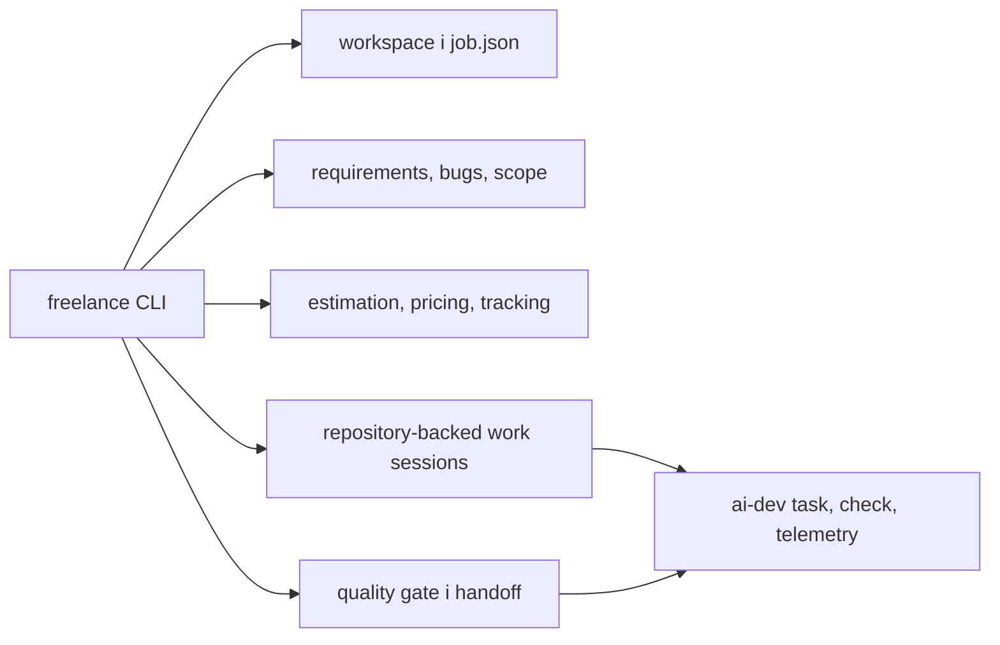

# Audyt aplikacji Freelance Dev Suite

Data: 2026-09-08
Zakres: całe repozytorium, otwarte issue, architektura, poprawność, bezpieczeństwo handoff,
testy, typowanie, CI i dystrybucja
Narzędzie audytowe: lokalny `ai-dev-cli-tools 1.2.1` z checkoutu
`C:\Users\Praca\fork\MatthiasLew\ai-dev-cli-tools`

## Wniosek wykonawczy

Repozytorium ma ukończony zakres funkcjonalny zapisany w `TODO.md` i jest działającym, dobrze
przetestowanym prototypem CLI. Nie jest jednak ukończonym wydaniem produktu.

Ocena: **MVP funkcjonalnie gotowe lokalnie, release NO-GO**.

Główne powody NO-GO:

1. aktualny `master` (`2fa13b9`) ma czerwone GitHub Actions;
2. nie ma tagu ani GitHub Release;
3. pakiet nie jest opublikowany w PyPI, mimo że wcześniejszy README sugerował taką instalację;
4. projekt sam deklaruje etap `Development Status :: 3 - Alpha`;
5. pozostają ryzyka współbieżności, atomowości części zapisów i ograniczonego skanowania sekretów.

Po poprawkach roboczych pełna walidacja lokalna przechodzi: 160 testów, Ruff, mypy, coverage
81,15%, build sdist/wheel oraz instalacja wheel w czystym środowisku testowym.

## Architektura i zakres

Repozytorium jest aplikacją Python 3.11+ opartą o Click i PyYAML. Logika domenowa znajduje się w
`packages/`, a `src/freelance_cli/cli.py` pozostaje wspólną warstwą orkiestracji.

Zakres roadmapy P0-P4 jest oznaczony jako wykonany. Dostępne są m.in. intake, wycena, wymagania,
bootstrap, obsługa bugów i scope change, timer i rentowność, portfolio, komunikacja, handoff oraz
wznawialne sesje pracy powiązane z repozytorium i telemetryką `ai-dev`.

## Naprawione problemy

### 1. Issue #2: test nadpisywał globalną konfigurację użytkownika

`WorkspaceManager(Config(...))` zapisywał licznik zleceń przez `save_config(..., None)`, co kierowało
zapis do `~/.freelance/config.yaml`. Obiekt konfiguracji przekazany przez test lub integratora mógł
więc nieoczekiwanie zmienić prawdziwą konfigurację użytkownika.

Manager zapisuje teraz konfigurację tylko wtedy, gdy sam ją wczytał albo otrzymał jawny
`config_path`. Test regresyjny potwierdza brak wywołania zapisu dla konfiguracji wyłącznie w pamięci.
Hash prawdziwego pliku konfiguracyjnego pozostał bez zmian podczas pełnego zestawu 160 testów.

### 2. CI nie instalowało pluginu używanego przez własną komendę

Workflow wywołuje pytest z `--cov`, lecz extra `dev` nie zawierało `pytest-cov`. Ostatni przebieg CI
na `master` zatrzymał się na błędzie `unrecognized arguments: --cov=...`; pozostałe zadania macierzy
zostały anulowane. Dodano `pytest-cov>=5.0` do zależności deweloperskich.

### 3. Niezgodna minimalna wersja silnika `ai-dev`

Extra `ai-dev` dopuszczało `ai-dev-cli-tools>=1.0`, chociaż moduł `freelance work` używa komend
`ai-dev task` i `ai-dev telemetry`, dodanych w linii 1.2. Minimalną wersję podniesiono do 1.2.0.

### 4. Quality Gate mógł zwracać fałszywy sukces

- nieudany `git status` z pustym stdout był interpretowany jako czyste repozytorium;
- brak jakichkolwiek testów, linta i typechecku był oznaczany jako `PASS`;
- rzeczywisty plik `.env` był pomijany przez skaner sekretów.

Po poprawce błąd Git daje ostrzeżenie, brak kontroli technicznych daje ostrzeżenie zamiast sukcesu,
niemożność uruchomienia istniejących testów blokuje gate, a prawdziwe pliki dotenv są skanowane.
Szablony `.env.example`, `.env.sample` i `.env.template` pozostają pomijane.

### 5. Nieprawdziwa instrukcja instalacji

PyPI nie zwraca dystrybucji `freelance-dev-suite`, a repo nie ma wydania. README informuje teraz
uczciwie, że bieżącą wersję należy instalować z repozytorium.

## Dowody walidacyjne

| Kontrola | Wynik |
|---|---:|
| `ai-dev doctor` | wymagane środowisko dostępne |
| `ai-dev scan` | sukces, 1 workspace Python |
| `ai-dev map` | 76 plików, bez obcięcia mapy |
| `ai-dev check --mode full --no-cache` | sukces, 3/3 kontroli |
| Pytest, Python 3.14 lokalnie | 160/160 |
| Pytest, Python 3.13 z repo na `PYTHONPATH` | 160/160 |
| Ruff | 0 błędów |
| mypy strict (`src`, `packages`) | 0 błędów |
| Coverage branch | 81,15%, próg 80% |
| `python -m build` | poprawny sdist i wheel |
| Wheel smoke test | instalacja i `freelance --version` zakończone kodem 0 |
| Ochrona konfiguracji użytkownika | hash bez zmian po pełnych testach |
| `git diff --check` | brak błędów whitespace |

Lokalne przebiegi w ograniczonym sandboxie początkowo zgłaszały `WinError 5` dla katalogów pytest.
Powtórzenie poza ograniczeniem plikowym dało komplet przejść. To ograniczenie środowiska wykonawczego,
nie defekt aplikacji.

## Stan CI i publikacji

Ostatni zdalny przebieg CI dla `2fa13b9` jest czerwony. Przyczyna została naprawiona w lokalnym
working tree, ale nie może być uznana za naprawioną zdalnie przed commit/push i zielonym readbackiem
całej macierzy Linux/Windows dla Pythonów 3.11-3.13.

Nie ma tagów ani GitHub Release. Wersja pozostaje `0.1.0`, a cały rozwój od pierwszej wersji znajduje
się w sekcji `Unreleased` changelogu.

## Ryzyka pozostające

- Generatory `JOB-ID`, `WORK-ID`, identyfikatorów timerów, bugów i zmian zakresu nie używają blokady
  międzyprocesowej. Dwa procesy mogą wybrać ten sam kolejny identyfikator.
- `job.json` i work sessions mają zapis atomowy, ale m.in. konfiguracja, time log i część raportów
  nadal używają bezpośredniego `write_text`/`open(..., "w")`; awaria w trakcie zapisu może uszkodzić
  artefakt.
- Skan sekretów jest tylko krótką listą regexów i nie przegląda historii Git. Nie zastępuje narzędzi
  takich jak Gitleaks lub TruffleHog.
- `src/freelance_cli/cli.py` ma około 1600 linii i skupia zbyt dużo orkiestracji. Utrudnia izolowane
  testowanie oraz dalsze rozszerzanie CLI.
- Najsłabsze pokrycie mają `work_commands`, komunikacja, bootstrap oraz granice integracji z
  `ai-dev`. Globalny próg 80% może ukrywać regresję w tych miejscach.
- Quality Gate traktuje część problemów jako ostrzeżenia, więc `PASS_WITH_WARNINGS` nadal pozwala na
  dostarczenie. Dla projektów o wyższym ryzyku potrzebna jest konfigurowalna polityka fail-closed.
- Brakuje potwierdzonego testu zdalnego na Pythonie 3.11/3.12 po bieżących poprawkach; taki dowód
  powinno dostarczyć zielone CI.

## Warunki uznania repo za ukończone

1. Zacommitować i wypchnąć bieżące poprawki na gałąź roboczą lub przez PR.
2. Otrzymać zielony wynik wszystkich sześciu zadań macierzy CI.
3. Zamknąć issue #2 dopiero po wskazaniu commita i readbacku z CI.
4. Ustalić politykę wydania: tag/GitHub Release oraz publikacja PyPI albo trwałe pozostawienie
   instalacji wyłącznie z GitHub.
5. Przed deklaracją wersji stabilnej naprawić blokady międzyprocesowe identyfikatorów i atomowość
   pozostałych krytycznych zapisów.

Po punktach 1-4 można uznać projekt za ukończone **alpha/MVP**. Do określenia go jako stabilnego,
produkcyjnego narzędzia potrzebny jest również punkt 5 oraz co najmniej jeden rzeczywisty pełny
przebieg zlecenia od intake do handoff.
