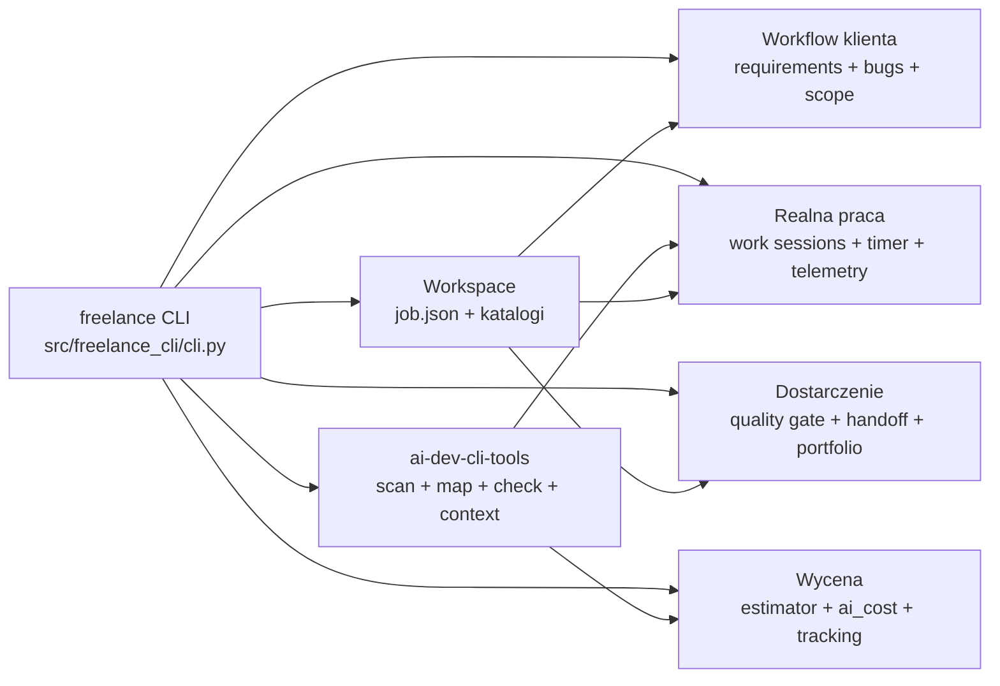

# Audyt aplikacji Freelance Dev Suite

Data: 2026-09-05  
Zakres: architektura, poprawność, bezpieczeństwo artefaktów, testy, typowanie i dystrybucja  
Narzędzie audytowe: `ai-dev-cli-tools 1.2.1`

## Wniosek wykonawczy

Projekt jest rozbudowanym, działającym prototypem CLI w fazie alpha. Ma sensowny podział domenowy,
duży zestaw testów i poprawnie buduje paczki Python. Audyt znalazł cztery rzeczywiste defekty:

1. aktualizacja zarchiwizowanego zlecenia tworzyła drugi egzemplarz w `active/`;
2. paczka przekazywana klientowi mogła zawierać pliki `.env.local` i `.env.production`;
3. ograniczenia wersji tej samej zależności były liczone jako różne pakiety;
4. generator projektu zgłaszał udaną inicjalizację Git mimo błędu `git init`, `git add` lub `git commit`.

Wszystkie cztery problemy zostały poprawione. Po zmianach pełna walidacja kończy się sukcesem:
157 testów przechodzi, Ruff i mypy nie zgłaszają problemów, pokrycie gałęziowe wynosi 81%, a sdist
i wheel budują się poprawnie.

## Jak zbudowana jest aplikacja

Repozytorium jest aplikacją Python 3.11+ opartą o Click i PyYAML. CLI stanowi warstwę orkiestracji,
a logika została rozdzielona na moduły domenowe w `packages/`.

Główne decyzje projektowe:

- dane są lokalne i plikowe, bez bazy danych: konfiguracja YAML, zlecenia i raporty JSON/Markdown;
- `WorkspaceManager` zarządza cyklem życia zlecenia i katalogami `active/` oraz `finished/`;
- analiza techniczna deleguje skanowanie i testy do zewnętrznego `ai-dev-cli-tools`;
- moduły `requirements`, `bugs`, `scope`, `tracking` i `communication` budują workflow freelancera;
- `handoff` uruchamia Quality Gate i tworzy dokumentację oraz `release.zip`;
- `work` łączy task, scope, wymagania, timer, kontekst `ai-dev`, walidację i rzeczywisty koszt AI;
- projekt jest pakowany przez Hatchling jako sdist/wheel i testowany na Pythonie 3.11-3.13 w CI.

Historia Git pokazuje duże, funkcjonalne commity realizowane kolejno według ticketów. Metadane commitów
wskazują wyłącznie autora `Mateusz Lewandowski`; repozytorium nie zapisuje informacji pozwalającej
niezależnie potwierdzić, że kod wygenerował konkretnie Gemini. Ocena dotyczy więc kodu i artefaktów,
nie deklarowanego modelu AI.

## Naprawione problemy

### 1. Duplikowanie zarchiwizowanego zlecenia

`save_job()` zawsze zapisywało do `active/`. Jeżeli zlecenie było już w `finished/`, zwykła zmiana
statusu pozostawiała starą kopię w archiwum i tworzyła nową kopię aktywną. Zapis wyszukuje teraz
istniejący katalog zlecenia i zachowuje jego położenie. Test regresyjny potwierdza jeden rekord i brak
ponownego pojawienia się zlecenia w `active/`.

### 2. Możliwy wyciek sekretów w paczce klienta

Archiwizer wykluczał tylko plik o dokładnej nazwie `.env`. Odmiany często używane w realnych
projektach, np. `.env.local` oraz `.env.production`, trafiały do `release.zip`. Obecnie wszystkie pliki
zaczynające się od `.env` są wykluczane poza jawnymi szablonami `.env.example`, `.env.sample` i
`.env.template`. Archiwizer pomija też dowiązania symboliczne, aby nie kopiować plików spoza projektu.

### 3. Zawyżony licznik zależności

Parser wycinał tylko znak `=`, więc `requests>=2`, `requests<3` i `requests==2.32` mogły być trzema
różnymi wpisami. Dodana normalizacja wyodrębnia nazwę dystrybucji przed extras, markerami i operatorami
wersji, dzięki czemu ograniczenia tej samej biblioteki są deduplikowane.

### 4. Fałszywy sukces inicjalizacji Git

Generator ignorował kody wyjścia wszystkich poleceń Git i zawsze ustawiał `git_initialized=True`.
Teraz sprawdza osobno `git init`, `git add` oraz `git commit`, a szczegóły błędu zwraca w `issues`.

## Dowody walidacyjne

| Kontrola | Wynik |
|---|---:|
| `ai-dev doctor` | wymagane środowisko dostępne |
| `ai-dev scan` | sukces, 1 workspace Python |
| `ai-dev map` | 69 plików, bez obcięcia mapy |
| `ai-dev check --mode full --no-cache` | sukces, 3/3 kontroli |
| Pytest | 157/157 testów |
| Ruff | 0 błędów |
| mypy strict (`src packages tests`) | 0 błędów w 66 plikach |
| Coverage | 81%, próg projektu 80% |
| `python -m build` | poprawny sdist i wheel |
| `git diff --check` | brak błędów whitespace |

Pierwszy test uruchomiony w ograniczonym sandboxie zgłosił 65 błędów `tmp_path` z `WinError 5`.
Powtórzenie tego samego zestawu poza ograniczeniem plikowym dało komplet przejść. Był to błąd
środowiska uruchomieniowego, nie aplikacji.

## Rozszerzenie `freelance work`

Dodany moduł realizuje pełny cykl `start → status/list → finish` oraz
`NEEDS_FIX → resume → finish`. Dane trafiają atomowo do `work/sessions/WORK-NNNN.json`.

- `start` analizuje scope, zapisuje powiązania z wymaganiami, pobiera bazowy stan telemetryki,
  przygotowuje adaptacyjny kontekst przez `ai-dev task` i uruchamia istniejący timer;
- `status` pokazuje aktualny task, czas, agenta/model, tokeny, koszt, scope i walidację;
- `finish` uruchamia `ai-dev check --mode changed`, zatrzymuje wyłącznie timer należący do sesji,
  wylicza różnicę provider-reported telemetry i ustawia `VERIFIED` albo `NEEDS_FIX`;
- `resume` przekazuje zapisany fingerprint jako `--ack-state`, więc nie wykonuje ślepego pełnego
  wczytania repozytorium, lecz nadal uwzględnia bieżące zmiany;
- raport rentowności preferuje rzeczywiste koszty zakończonych sesji nad estymacją z intake.

Rozwiązanie zachowuje wyraźną granicę: suite przechowuje kontekst klienta, zakres, czas i pieniądze,
a `ai-dev-cli-tools` pozostaje właścicielem mapy repozytorium, doboru kontekstu, testów i telemetryki.

## Ryzyka pozostające po audycie

- `src/freelance_cli/cli.py` jest monolitycznym modułem orkiestracji; dalszy rozwój powinien przenieść
  komendy do osobnych modułów Click bez zmiany publicznego CLI.
- Zapis `job.json` jest już atomowy, a stary licznik nie nadpisze istniejącego ID, ale generatory
  `JOB-ID` i `WORK-ID` nie mają blokady międzyprocesowej. Dwa równoległe procesy nadal mogą ścigać się
  o ten sam kolejny identyfikator.
- Skan sekretów opiera się na krótkiej liście wyrażeń regularnych. Nie zastępuje narzędzia takiego jak
  Gitleaks/TruffleHog ani przeglądu historii Git.
- CI obejmuje teraz Linux i Windows dla Pythona 3.11-3.13; koszt macierzy to sześć przebiegów na zmianę.
- Część generowanej dokumentacji handoff jest ogólna i może podawać niepasujące instrukcje Python/.NET.
  Przed wysłaniem klientowi powinna wynikać z wykrytego stosu projektu.
- Najsłabsze pokrycie mają integracja z `ai-dev`, komunikacja i techniczny Quality Gate. Całościowy próg
  80% przechodzi, ale testy tych granic powinny być rozwijane niezależnie.

## Rekomendowany następny etap

Największą wartość da teraz blokada międzyprocesowa generatorów identyfikatorów i jednoznaczne
wykrywanie konfliktów. Następnie warto dalej rozbijać moduł CLI i rozszerzyć test instalacji z gotowego
wheel o pełny przebieg `freelance work` na tymczasowym repozytorium.
