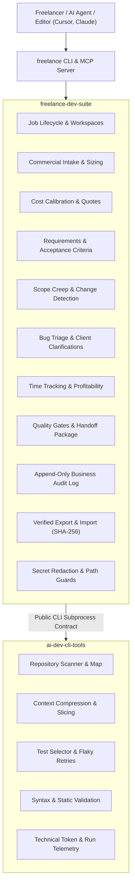

# Architecture & System Design

`freelance-dev-suite` is an open-source, production-grade CLI toolkit designed for freelance software engineers and boutique technical consultancies.

It manages the entire commercial and operational lifecycle of software engagements—from intake, estimation, and formal requirements to scoped implementation sessions, change detection, client communications, quality gates, and project delivery.

---

## 1. System Boundary & Layer Separation

A core architectural principle of `freelance-dev-suite` is the strict separation between the **Business / Workflow Layer** and the **Technical Execution Engine**.



### Layer Responsibilities

| Responsibility | Handled By | How it is Handled |
| :--- | :--- | :--- |
| Commercial intake, client metadata, budget | `freelance-dev-suite` | `Job`, `packages/intake`, `packages/workspace` |
| Repository mapping, token budgeting | `ai-dev-cli-tools` | `ai-dev repo-scan`, `ai-dev context` |
| Pricing calculation, quote generation | `freelance-dev-suite` | `packages/estimator` |
| Codebase syntax & static health checks | `ai-dev-cli-tools` | `ai-dev validate` |
| Time tracking, profitability, margin | `freelance-dev-suite` | `packages/tracking` |
| Focused test selection & execution | `ai-dev-cli-tools` | `ai-dev run-tests` |
| Scope creep & extra billable change detection | `freelance-dev-suite` | `packages/scope` |
| Handoff quality gates, archive generation | `freelance-dev-suite` | `packages/handoff`, `packages/archive` |
| Local AI assistant tooling (MCP) | `freelance-dev-suite` | `packages/mcp` (Stdio JSON-RPC 2.0) |

`freelance-dev-suite` **never** duplicates repository scanners, semantic AST engines, test selectors, or git diff analyzers. When technical diagnostics or context slices are needed, it calls `ai-dev` via its documented public CLI interface.

---

## 2. Directory Layout & Storage Model

All persistent state is stored locally inside the configured workspace root (default: `~/.freelance`). No cloud databases, remote services, or proprietary backends are required.

```text
~/.freelance/
├── config.json                 # Global configuration (hourly rate, currencies, templates)
├── .timeline.lock              # Process lock for global events
├── active/                     # Currently active client jobs
│   └── JOB-001-client-slug/
│       ├── job.json            # Core job metadata & state machine status
│       ├── .job.lock           # Atomic job storage lock
│       ├── analysis/
│       │   ├── intake.json     # Intake analysis & risk profile
│       │   ├── estimate.json   # Cost, hours, and pricing breakdown
│       │   └── requirements.json # Acceptance criteria & specifications
│       ├── scope/
│       │   ├── baseline.json   # Initial baseline requirement snapshot
│       │   └── changes.json    # Detected scope changes & surcharges
│       ├── work/
│       │   ├── timer.json      # Active timer state
│       │   └── sessions/
│       │       ├── WORK-001.json # Tracked session with diffs & summaries
│       │       └── WORK-002.json
│       ├── bugs/
│       │   └── BUG-001.json    # Bug reports & triage questions
│       ├── handoff/
│       │   ├── verification.json # Quality gate verification results
│       │   └── HANDOFF.md        # Generated client deliverable guide
│       └── history/
│           └── events.jsonl    # Append-only chronological business timeline
└── completed/                  # Archived / finalized client jobs
    └── JOB-000-sample/
```

---

## 3. Concurrency & Re-Entrancy Architecture

Multiple CLI commands, background tasks, or AI editor extensions may access the workspace concurrently. To guarantee zero data corruption, `freelance-dev-suite` implements:

1. **Cross-Process File Locking (`storage_lock`)**:
   - Implemented in `packages/storage_utils.py` using `filelock.FileLock`.
   - Protects read-modify-write operations on state files (`.job.lock`, `.work.lock`, `.timeline.lock`).
2. **Thread-Local Re-Entrancy**:
   - Windows and certain Unix locking semantics can deadlock if the same OS thread attempts to re-acquire an already held lock (for example, `WorkManager.finish()` calling `next_work_id()` or recording a timeline event).
   - Thread-local tracking (`_active_locks.held`) bypasses nested lock requests within the same thread while keeping cross-process and cross-thread exclusion intact.
3. **Atomic File Writes (`atomic_write_json`, `atomic_write_text`)**:
   - Files are written to a temporary sibling (`<filename>.<pid>.<uuid>.tmp`) and flushed to disk before an atomic `os.replace` operation.
   - Prevents partially written or zero-byte corrupted files if a process is killed mid-write.

---

## 4. Schema Versioning & Forward Compatibility

Every persistent data model (`Job`, `WorkSession`, `BugReport`, `ScopeChangeItem`, `TimeLog`, `ProfitabilityReport`, `RequirementsSpec`) implements:
- Explicit `schema_version = "1.0"`.
- Resilient `from_dict` deserializers that supply sensible defaults when non-critical fields are absent.
- `safe_read_json` validation that rejects incompatible future major versions with `IncompatibleSchemaError` and corrupted payloads with `CorruptedStateError`.

---

## 5. Extensibility & Integration

- **CLI Engine**: Built on `click` with comprehensive help, structured JSON envelopes, and dry-run explanations.
- **Model Context Protocol (MCP)**: Local stdio-based server conforming to JSON-RPC 2.0, providing tools to Claude Desktop, Cursor, and Copilot.
- **Archive Portability**: Gzipped tarball archives with SHA-256 integrity checksums and path traversal protections.
